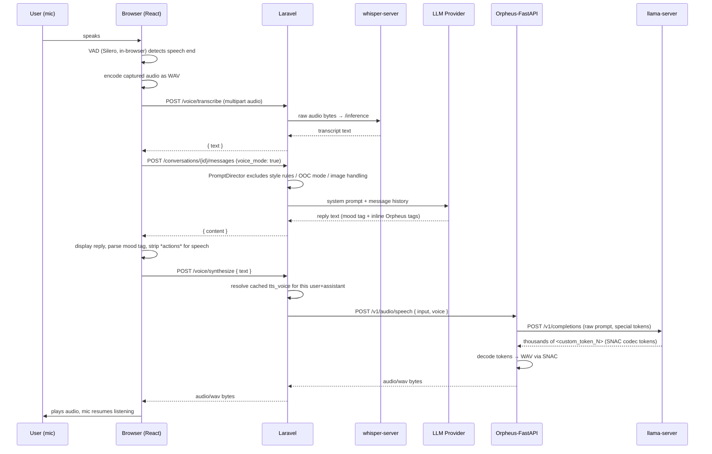

# VERA — Architecture Analysis

> Volatile Emotional Response Architecture
> A local-first multi-AI platform with a dynamic expression system.

---

## Overview

VERA is a full-stack web application that connects users to AI assistants through a stylized, character-driven interface. Each assistant is fully configured in the database — its personality, prompt, expression set, and opening message are all data-driven with no hardcoded content. LLM providers and models are managed through the UI. A config-based fallback is used when no model is selected.

---

## Tech Stack

| Layer | Technology |
|---|---|
| Backend | Laravel 13 (PHP 8.4) |
| Frontend | React 19 via Vite + React Router |
| Styling | Tailwind CSS v4 |
| LLM Runtime | Any OpenAI-compatible API or Anthropic (DB-managed) |
| STT (voice input) | whisper.cpp (`whisper-server`, local, OpenAI-compatible-ish `/inference`) |
| TTS (voice output) | Orpheus 3B via Orpheus-FastAPI, served by llama.cpp (`llama-server`) |
| Voice activity detection | `@ricky0123/vad-web` (Silero VAD, ONNX, self-hosted) |
| Database | PostgreSQL |
| Auth | Laravel Sanctum (SPA / cookie-based) |
| Dev Environment | Laravel Herd (macOS) |

---

## High-Level Architecture

```
Browser (React SPA — React Router)
    |
    |-- GET  /sanctum/csrf-cookie                               (Sanctum handshake)
    |-- POST /login                                             (AuthController)
    |-- GET  /api/user                                          (auth check on load)
    |-- GET|POST|PATCH|DELETE /api/assistants                   (AssistantController)
    |-- GET  /api/assistants/{assistant}/settings               (SettingsController@show)
    |-- PUT  /api/assistants/{assistant}/settings               (SettingsController@update — theme)
    |-- PUT  /api/assistants/{assistant}/settings/model         (SettingsController@selectModel)
    |-- GET  /api/assistants/{assistant}/emotions               (EmotionController)
    |-- POST|POST|DELETE /api/assistants/{assistant}/emotions   (AssistantEmotionController)
    |-- GET|POST /api/assistants/{assistant}/conversations
    |-- GET|POST /api/assistants/{assistant}/conversations/{id}/messages
    |-- DELETE|PATCH /api/assistants/{assistant}/conversations/{id}
    |-- GET|POST|PUT|DELETE /api/assistants/{assistant}/prompt
    |-- POST /api/assistants/{assistant}/voice/transcribe        (VoiceController@transcribe)
    |-- POST /api/assistants/{assistant}/voice/synthesize        (VoiceController@synthesize)
    |-- GET  /vendor/vad/{file}.mjs                              (VadAssetController, unauthenticated)
    |-- GET|POST|PATCH|DELETE /api/ai-providers
    |-- POST|PATCH|DELETE /api/ai-providers/{provider}/models
    |-- GET|POST /api/archives
    |-- GET|POST /api/archives/{id}
    |
Laravel Backend (API)
    |
    |-- Sanctum session auth (cookie + CSRF)
    |-- ConversationController proxies to LLM via LlmProvider contract
    |-- PromptDirector assembles system prompt from Assistant->prompt (DB)
    |-- LlmManager resolves provider: user Settings → AiModel → AiProvider → GenericProvider or AnthropicProvider
    |-- Falls back to config/ai.php if no model selected
    |-- VoiceController proxies to SttProvider / TtsProvider contracts (config-resolved, single backend)
    |-- Persists conversations, messages, images to PostgreSQL / disk
    |-- EmbedArchiveEntry job dispatches async embeddings on archive entry create/update
    |
LLM (resolved by LlmManager)              Voice (config-bound singletons)
    |                                          |
    |-- GenericProvider   → OpenAI-compat      |-- SttProvider → WhisperSttProvider → whisper-server (STT)
    |-- AnthropicProvider → Anthropic API      |-- TtsProvider → OrpheusTtsProvider → Orpheus-FastAPI → llama-server (TTS)
```

The SPA pattern means Laravel serves a single Blade view which loads the React bundle. All subsequent interaction is via JSON API calls.

---

## Backend

### Routing

**`routes/web.php`**
- `GET /` — serves the Blade entry point (React SPA shell)
- `POST /login` — `AuthController@login`
- `POST /logout` — `AuthController@logout`
- `GET /vendor/vad/{file}` — `VadAssetController`, unauthenticated, `.mjs` files only (see [Serving VAD's WASM Assets](#serving-vads-wasm-assets))

**`routes/api.php`**
All routes behind `auth:sanctum` middleware:

| Method | Route | Handler |
|---|---|---|
| GET | `/api/user` | returns authenticated user |
| GET | `/api/assistants` | `AssistantController@index` |
| POST | `/api/assistants` | `AssistantController@store` |
| GET | `/api/assistants/{id}` | `AssistantController@show` |
| PATCH | `/api/assistants/{id}` | `AssistantController@update` |
| DELETE | `/api/assistants/{id}` | `AssistantController@destroy` |
| GET | `/api/assistants/{assistant}/settings` | `SettingsController@show` |
| PUT | `/api/assistants/{assistant}/settings` | `SettingsController@update` (theme) |
| PUT | `/api/assistants/{assistant}/settings/model` | `SettingsController@selectModel` |
| GET | `/api/assistants/{assistant}/emotions` | `EmotionController@index` |
| POST | `/api/assistants/{assistant}/emotions` | `AssistantEmotionController@store` |
| POST | `/api/assistants/{assistant}/emotions/{emotion}` | `AssistantEmotionController@update` |
| DELETE | `/api/assistants/{assistant}/emotions/{emotion}` | `AssistantEmotionController@destroy` |
| GET | `/api/assistants/{assistant}/conversations` | `ConversationController@index` |
| POST | `/api/assistants/{assistant}/conversations` | `ConversationController@store` |
| GET | `/api/assistants/{assistant}/conversations/{id}/messages` | `ConversationController@show` |
| POST | `/api/assistants/{assistant}/conversations/{id}/messages` | `ConversationController@sendMessage` |
| DELETE | `/api/assistants/{assistant}/conversations/{id}` | `ConversationController@destroy` |
| PATCH | `/api/assistants/{assistant}/conversations/{id}` | `ConversationController@update` |
| GET | `/api/assistants/{assistant}/prompt` | `AssistantPromptController@show` |
| POST | `/api/assistants/{assistant}/prompt` | `AssistantPromptController@store` |
| PUT | `/api/assistants/{assistant}/prompt` | `AssistantPromptController@update` |
| DELETE | `/api/assistants/{assistant}/prompt` | `AssistantPromptController@destroy` |
| POST | `/api/assistants/{assistant}/voice/transcribe` | `VoiceController@transcribe` — audio in, text out |
| POST | `/api/assistants/{assistant}/voice/synthesize` | `VoiceController@synthesize` — text in, audio/wav out |
| GET | `/api/ai-providers` | `AiProviderController@index` |
| POST | `/api/ai-providers` | `AiProviderController@store` |
| PATCH | `/api/ai-providers/{id}` | `AiProviderController@update` |
| DELETE | `/api/ai-providers/{id}` | `AiProviderController@destroy` |
| POST | `/api/ai-providers/{provider}/models` | `AiModelController@store` |
| PATCH | `/api/ai-providers/{provider}/models/{model}` | `AiModelController@update` |
| DELETE | `/api/ai-providers/{provider}/models/{model}` | `AiModelController@destroy` |
| GET | `/api/archives` | `ArchiveController@index` |
| GET | `/api/archives/{id}` | `ArchiveController@show` |
| POST | `/api/archives` | `ArchiveController@save` (create) |
| POST | `/api/archives/{id}` | `ArchiveController@save` (update) |

### Controllers

**`AuthController`**
Standard Sanctum SPA login: validates credentials, calls `Auth::attempt()`, regenerates session. Logout invalidates session and regenerates CSRF token.

**`AssistantController`**
Full CRUD for `Assistant` records, scoped to the authenticated user:

- `index` — returns all user's assistants with conversation stats and default emotion image
- `show` — returns full assistant detail including emotions, restricted_emotions, and archive_id
- `store` — creates assistant via multipart form; requires at least one `default` emotion with image upload; wraps in DB transaction; attaches user via pivot
- `update` — patches scalar fields (name, slug, description, opening_message, prompt, archive_id)
- `destroy` — deletes the assistant

**`AssistantEmotionController`**
Manages emotions for a specific assistant:

- `store` — creates a new emotion with image upload; rejects duplicate names
- `update` — renames and/or replaces the image for an existing emotion; deletes old image from disk
- `destroy` — deletes emotion and its image; rejects deletion of the `default` emotion

**`ConversationController`**
Full conversation lifecycle, scoped to `assistants/{assistant}`:

- `index` — conversations for the authenticated user under the given assistant
- `store` — creates a new conversation; seeds the first message from `Assistant->opening_message`
- `destroy` — deletes a conversation (cascades to messages)
- `update` — renames a conversation
- `show` — returns paginated messages with image URLs resolved from storage
- `sendMessage`:
  1. Validates `messages[]` array (role/content/images)
  2. Saves the last user message; stores any attached image via `Image::storeFromBase64()`
  3. Loads the `Assistant` model and its emotion set
  4. Builds system prompt via `PromptDirector($assistant->prompt)` — prompt comes from the DB
  5. Injects available emotions and runs RAG retrieval against the linked archive if available
  6. Resolves the LLM provider via `LlmManager::forAssistantUser()`
  7. Calls `chat()`, saves the assistant reply (content + thinking)
  8. Returns `conversation_id`, `content`, `thinking`

**`AiProviderController`**
CRUD for `AiProvider` records. API key is encrypted at rest and never returned in responses (`has_key` boolean appended instead). Validates `format` against the `AiProviderFormat` enum.

**`AiModelController`**
CRUD for `AiModel` records nested under a provider. Manages `name`, `endpoint`, `thinking`, `prompt`, `config`.

**`SettingsController`**
- `show` — returns `selected_theme`, `available_themes`, `ai_model_id`, `tts_voice`, `available_voices` (scoped to the given assistant)
- `update` — saves theme and (optionally) `tts_voice`, merging into existing settings data; on `tts_voice` change, writes straight through to cache (`Cache::forever`) so `VoiceController::synthesize` never queries the DB on the hot path
- `selectModel` — saves `ai_model_id` into settings data, or clears it (nullable)

**`EmotionController`**
Returns the emotion set for the active assistant filtered by `restricted` flag. `?unlocked=true` returns alternate expressions.

**`AssistantPromptController`**
Manages the `prompt` JSON on an `Assistant` record:
- `show` — returns the current prompt JSON
- `store` — creates the prompt (409 if one already exists); validated by `ValidPromptStructure`
- `update` — replaces the prompt; validated by `ValidPromptStructure`
- `destroy` — clears the prompt (sets to `[]`)

`ValidPromptStructure` is a custom validation rule that enforces the prompt tree structure: top-level must be an associative array; each value must be a string, a sequential array of strings, or a nested associative array (recursive).

**`VoiceController`**
Scoped to `assistants/{assistant}`, behind `auth:sanctum`. See [Voice Mode](#voice-mode) for the full pipeline.
- `transcribe` — accepts an uploaded audio file (`audio`, multipart), passes raw bytes to `SttProvider::transcribe()`, returns `{ text }`
- `synthesize` — accepts `{ text }`, resolves the user's cached voice preference (see [Voice Settings & Caching](#voice-settings--caching)), calls `TtsProvider::synthesize()`, returns raw `audio/wav` bytes directly in the response body (not JSON)

**`VadAssetController`**
Unauthenticated, registered in `web.php` (not `api.php`). Serves `.mjs` files from `storage/app/vad/` with an explicit `text/javascript` Content-Type — see [Serving VAD's WASM Assets](#serving-vads-wasm-assets) for why this exists at all.

**`ArchiveController`**
Reads and saves the user's archives (RAG knowledge base). Each archive has a name, description, and a set of entries with title, content, keywords, and tags. The `save` action (POST) handles both create and update in a single endpoint — if `{id}` is provided, it updates; otherwise creates. Entries not present in the payload are deleted. On entry create or content change, `EmbedArchiveEntry` is dispatched for async embedding.

### LLM Provider System

**`App\Contracts\LlmProvider`**
```php
interface LlmProvider {
    public function chat(array $messages): LlmResponse;
    public static function fromModel(AiModel $aiModel): static;
}
```

**`App\DTOs\LlmResponse`**
Unified return type: `content` (string) + `thinking` (nullable string).

**`App\Enums\AiProviderFormat`**
```php
enum AiProviderFormat: string {
    case Generic   = 'generic';    // any OpenAI-compatible API
    case Anthropic = 'anthropic';  // Anthropic API
}
```
Each case maps to a provider class via `providerClass()`.

**`App\Services\LlmProviders\LlmManager`**
Resolution order:
1. `forAssistantUser(AssistantUser $assistantUser)` — looks up `Settings` for the user+assistant pair
2. If `ai_model_id` is set → loads `AiModel` with its `AiProvider` → calls `fromModel()`
3. If no model selected → `fromConfig()` reads `config/ai.php` and constructs synthetic model/provider objects

**`GenericProvider`**
Handles any OpenAI-compatible chat completions API. Supports:
- Bearer token auth (optional)
- Multipart image messages (`image_url` content type)
- Configurable thinking/reasoning budget via provider `config_schema.thinking_key`
- Per-model `max_tokens` and `timeout` from config

**`AnthropicProvider`**
Handles the Anthropic Messages API with extended thinking support.

**`config/ai.php`**
Defines the config-based fallback (`default`) and auxiliary config blocks (`embedding`, `telegram`). The `default` block mirrors the shape of an `AiModel`+`AiProvider` so `LlmManager::fromConfig()` can construct provider instances from it.

### Prompt System

The system prompt is assembled entirely on the backend from data stored in the database.

**`App\Builders\PromptBuilder`**
Renders a prompt config array recursively into natural language. Strings pass through as-is, sequential arrays become comma-separated lists, associative arrays become labeled sub-sections.

**`App\Directors\PromptDirector`**
Accepts the `Assistant->prompt` JSON array (from DB) as its config. Supports `only([...])`, `except([...])`, and `append(key, value)` for injecting dynamic data (e.g. emotion tags, retrieved lore). Called on every `sendMessage` request. Also supports `withRetrieval()` for RAG — embedding the user's message and retrieving semantically similar archive entries.

### Models & Database

**`User`** — standard Laravel user; belongs to many `Assistant`s via `AssistantUser`

**`Assistant`**
- `name`, `slug`, `description`, `prompt` (JSON), `opening_message`, `archive_id` (nullable FK)
- Belongs to many `User`s via `AssistantUser`; has many `Emotion`s
- `archive_id` links the assistant to a specific `Archive` for RAG injection

**`AssistantUser`** (pivot)
- Links `User` ↔ `Assistant`; has many `Conversation`s scoped to this pairing

**`Settings`**
- `user_id`, `assistant_id`, `data` (JSON)
- Stores: `theme`, `ai_model_id`, `tts_voice`
- Scoped per user+assistant pair
- `Settings::ttsVoiceCacheKey($userId, $assistantId)` — static helper so `SettingsController` (writer) and `VoiceController` (reader) compute the identical cache key without duplicating the format string

**`AiProvider`**
- `name`, `url`, `api_key` (encrypted), `format` (`AiProviderFormat` enum), `prompt`, `config_schema` (JSON)
- `api_key` is hidden; `has_key` boolean is appended
- Has many `AiModel`s

**`AiModel`**
- `provider_id`, `name`, `endpoint`, `thinking` (boolean), `prompt`, `config` (JSON)
- `endpoint` is the model identifier sent to the API (e.g. `google/gemma-4-26b-a4b-it`)
- Belongs to `AiProvider`

**`Conversation`**
- `assistant_user_id`, `title`
- Has many `Message`s

**`Message`**
- `conversation_id`, `role`, `content`, `thinking`, `emotion`
- `thinking` stores the LLM's internal reasoning chain
- `emotion` is defined but not yet written by the controller (frontend-only state)

**`Emotion`** — `name`, `restricted`, `assistant_id`; morphOne `Image`, morphOne `Video`

**`Archive`** — `name`, `description`, `user_id`; has many `ArchiveEntry`s; belongs to `User`

**`ArchiveEntry`** — `archive_id`, `title`, `content`, `keywords` (array); many-to-many `Tag`s; embedding dispatched on create/content change

**`Tag`** — `name`, `user_id`

**`Image`** — polymorphic (`imageable_type/id`), disk-stored, `url` accessor
**`Video`** — polymorphic (`videoable_type/id`), disk-stored, `url` accessor

### Jobs

**`EmbedArchiveEntry`** — async job dispatched by `ArchiveController` when an entry is created or its content changes; handles vector embedding for RAG retrieval.

### Artisan Commands

**`php artisan emotions:sync`** — seeds/updates `Emotion` records
**`php artisan telegram:poll`** — long-polls Telegram Bot API, routes messages through the LLM pipeline

---

## Frontend

### Routing

The app uses React Router. `app.jsx` defines all routes:

```
/login                               → LoginPage
/assistants                          → AssistantsPage        (authenticated)
/assistants/create                   → CreateAssistantPage   (authenticated)
/assistants/:assistantId/edit        → EditAssistantPage     (authenticated)
/assistants/:assistantId/            → AssistantLayout       (authenticated)
  conversations                      → ConversationsPage
  conversations/:id                  → ChatPage
  prompt                             → PromptPage
  archive                            → ArchivePage
  settings                           → SettingsPage
  providers                          → ProvidersPage
*                                    → redirect to /assistants
```

`AuthenticatedLayout` wraps all protected routes — handles auth check on mount and provides emotion state, boot sequence, and toast context via `useOutletContext`.

`AssistantLayout` wraps all assistant-scoped routes — fetches conversations, assistant info, and settings on `assistantId` change; passes `assistantId`, `assistantName`, `archiveId`, `conversations`, `setConversations`, and `fetchConversations` down via outlet context.

### Theme System

Themes are defined by the `Theme` enum (`app/Enums/Theme.php`): `default`, `terminal`, `slate`, `grimoire`. Each maps to a CSS file under `resources/css/themes/` that declares semantic CSS custom properties (colors, fonts, radii, shadows) scoped to `[data-theme="<value>"]`. Layout and spacing tokens defined in `base.css` are theme-independent so switching themes never causes a reflow — only a re-skin.

`ThemeContext` (React) holds the active theme string. On mount it fetches `GET /api/assistants/{assistant}/settings`, reads `selected_theme`, and sets `document.documentElement.setAttribute('data-theme', theme)`. Theme changes call `PUT /api/assistants/{assistant}/settings` with the new value and update the attribute immediately.

`SettingsController@show` returns `available_themes` by calling `array_column(Theme::cases(), 'value')`, so any new case added to the enum automatically appears as an option in the UI without further changes.

The selected theme is stored in the `data` JSON column of the `Settings` model, scoped to the user + assistant pair. The `update` method merges the theme key rather than overwriting the entire data object, preserving other settings (e.g. `ai_model_id`).

### Pages

**`LoginPage`**
Email → password → authenticate. Calls `getCsrfCookie()` then `POST /login`.

**`AssistantsPage`**
Lists all assistants belonging to the authenticated user. Shows conversation count, last activity, and default emotion avatar. Supports delete with confirmation. Links to create and edit pages.

**`CreateAssistantPage`**
Multipart form to create a new assistant: name, slug, description, opening message, prompt JSON, and required emotion images (at least one named `default`). Also accepts restricted emotions.

**`EditAssistantPage`**
Edit assistant fields (name, slug, description, opening message) and manage emotions via `AssistantEmotionController`. Uses `EmotionGrid` for add/rename/replace/delete emotion interactions.

**`ConversationsPage`**
Lists conversations for the active assistant. Create, select (navigate to `conversations/:id`), delete, rename.

**`ChatPage`**
Main chat interface:
- Message list with `ChatMessage` components
- Input bar with image attachment
- Emotion tag parsed from each response → `Portrait` expression swap
- `BootSequence` plays on first load for a new conversation

**`ArchivePage`**
Archive editor. Displays entries with title, content, keywords, and tags. Saves via `POST /api/archives` or `POST /api/archives/{id}`.

**`PromptPage`**
Visual prompt editor for the active assistant. Renders the prompt JSON as an interactive tree of `PromptNode` components. Supports adding, renaming, and deleting sections at any depth. Each node can be a string, list of strings, or nested object. Changes are saved via `PUT /api/assistants/{assistant}/prompt` (or `POST` if no prompt exists yet). The entire prompt can also be deleted from this page. Raw JSON toggle available.

**`SettingsPage`**
Theme selector. Fetches available themes from `GET /api/assistants/{assistant}/settings`, applies selection via `PUT /api/assistants/{assistant}/settings`.

**`ProvidersPage`**
AI provider and model management:
- Lists providers via `useProviders` hook
- `ProviderAccordion` for each provider (collapsible config form)
- `ModelAccordion` nested per model — shows SELECT button in header; clicking `● ACTIVE` deselects
- Active model loaded from `GET /api/assistants/{assistant}/settings` on mount; selection saved to `PUT /api/assistants/{assistant}/settings/model`

### Key Components

**`Accordion`** (`components/common/`)
Reusable collapsible panel. Props: `label`, `title`, `collapsed`, `onToggle`, `onDelete`, `badge` (rendered in header), `actions` (rendered in header right side, stopPropagation handled).

**`ProviderAccordion`**
Provider config form (name, URL, API key, format, prompt, config schema) inside an `Accordion`. Embeds `ModelAccordion` for each model. Passes `activeModelId` and `onSelectModel`/`onDeselect` down.

**`ModelAccordion`**
Model config form (name, endpoint, thinking, prompt, config) inside an `Accordion`. Header shows `● ACTIVE` badge (clickable to deselect) and `SELECT` button when applicable.

**`EmotionGrid`**
Displays the current emotion set for an assistant. Supports adding new emotions (name + image upload), renaming, replacing images, and deleting. Used in `EditAssistantPage`.

**`PromptEditor`**
Standalone prompt tree editor used in create/edit flows (before a prompt is saved to the DB). Mirrors `PromptNode` but operates on local state.

**`Portrait`**
Three rendering modes:
1. **Unauthenticated** — pixelated, dark canvas lock screen
2. **Video intro** — plays a short video on the first `neutral` emotion after auth
3. **Authenticated** — emotion-mapped image from `useEmotions` with scanline overlay and mood label

When no assistant is active, renders a neutral waiting state.

**`ChatMessage`** — renders a single message; differentiates assistant / user labels, handles thinking blocks and images
**`ThinkingBlock`** — collapsible chain-of-thought display
**`BootSequence`** — animated startup sequence, fires `onComplete` callback
**`Header`** — navigation header rendered within authenticated views
**`ConfirmationModal`** — modal with configurable options
**`ConversationList`** — sidebar list with create/delete/rename
**`ToastContainer`** / **`Scanlines`** — toast display and CRT overlay

### Hooks

**`useAssistants(addToast)`**
- Loads assistants from `GET /api/assistants`
- `deleteAssistant(id)` — calls DELETE and removes from local state

**`useProviders(addToast)`**
- Loads providers from `GET /api/ai-providers` and active model from `GET /api/assistants/{assistant}/settings` in parallel
- Full CRUD: `addProvider`, `saveProvider`, `deleteProvider`, `addModel`, `saveModel`, `deleteModel`
- `activeModelId` state + `selectModel(modelId)` — calls `PUT /api/assistants/{assistant}/settings/model`; `null` deselects

**`usePrompt(assistantId, addToast)`**
- Loads the assistant's prompt JSON from `GET /api/assistants/{assistant}/prompt`
- Manages the prompt tree in local state via `structuredClone` for immutable updates
- `setValueAtPath(path, value)` — update any leaf node by path array
- `addKey(parentPath, key, type)` — add a string, list, or object node
- `removeKey(path)` / `renameKey(path, newKey)` — structural edits (rename preserves key order)
- `addListItem(path)` / `removeListItem(path, index)` / `updateListItem(path, index, value)` — list management
- `save()` — POST (create) or PUT (update) depending on whether a prompt exists
- `destroy()` — DELETE and reset local state to null

**`useLocalPrompt`**
- Local-only prompt state manager used in create/edit assistant flows before the prompt is persisted to the DB
- Same tree manipulation API as `usePrompt` but without API calls

**`useEmotions`** — fetches emotion name → `{ image_url, video_url }` map; `fetchEmotions(assistantId)` to reload for a specific assistant
**`useToast`** — add/remove toasts with auto-dismiss

### Utilities

**`api.js`** — fetch wrapper; `credentials: 'include'`, `Accept: application/json`, Sanctum CSRF helper
**`parsers.js`** — strips `[emotion]` tag from response, validates against known names, falls back to `neutral`
**`formatMessage.jsx`** — `*text*` → italic, `(text)` → purple italic, `[text]` → bold cyan

---

## Data Flow: A Single Chat Turn

```
1. User types message, hits Enter
2. ChatPage: append user message to local state, show loading cursor
3. ChatPage: POST /api/assistants/{assistant}/conversations/{id}/messages
   body: { messages: [...history, user_msg] }  — no system prompt, backend adds it
4. ConversationController: validate → find Conversation → save user Message + Image
5. Load Assistant model → fetch its emotion set from DB
6. PromptDirector($assistant->prompt): prompt JSON comes from DB
   → inject emotion tags via append()
   → run RAG via withRetrieval() against linked Archive if assistant has archive_id
   → build system prompt string
7. LlmManager::forAssistantUser(): checks Settings for ai_model_id
   → if set: load AiModel + AiProvider → instantiate GenericProvider or AnthropicProvider
   → if not set: fromConfig() builds provider from config/ai.php
8. LlmProvider.chat([system_prompt, ...messages]) → LlmResponse
9. ConversationController: save assistant Message → return JSON
10. ChatPage: parseEmotionFromResponse(content) → extract [tag] + clean text
11. ChatPage: setCurrentEmotion(emotion) → Portrait swaps expression
12. ChatPage: render ChatMessage with formatted text + thinking block
```

---

## Voice Mode

Voice mode wraps the existing text chat pipeline with speech in and speech out. The LLM layer is completely unaware voice is involved — it still receives and returns plain text. Two new stages bookend the existing flow: **STT** converts microphone audio to text before it enters `sendMessage`, and **TTS** converts the assistant's text reply to audio after it comes back.

```
User speaks → mic captures audio → VAD detects silence → audio sent to backend
→ STT transcribes to text → text enters existing chat pipeline (unchanged)
→ LLM responds with text → text sent to TTS → audio returned
→ browser plays audio → loop waits for user to speak again
```

### Pipeline Diagram



### Infrastructure Stack

Voice mode depends on three local processes that are **not** managed by Laravel, Herd, or any queue — they must be running independently, same as the database:

| Service | Binary | Port | Role |
|---|---|---|---|
| STT inference | `whisper-server` (whisper.cpp, Homebrew) | `8080` | Transcribes audio → text, Metal-accelerated |
| TTS token generation | `llama-server` (llama.cpp, Homebrew) | `8081` | Runs the Orpheus 3B GGUF, generates SNAC audio tokens |
| TTS wrapper | Orpheus-FastAPI (separate cloned repo, Python/FastAPI) | `5005` | Formats the TTS prompt, calls `llama-server`, decodes tokens to WAV via SNAC |

**Why llama.cpp and not Ollama for TTS**, despite Ollama already running for embeddings: Orpheus-FastAPI's prompt format wraps the input in raw special tokens (`<|audio|>{voice}: {text}<|eot_id|>`) that are supposed to force the model into "generate audio tokens" mode. Ollama's `/v1/completions` endpoint does not reliably honor these — in testing, the same model served through Ollama would intermittently fall back to normal chat-style text generation instead of audio tokens (producing garbled or unrelated speech, or silence). The identical model served through `llama-server` handled this reliably across repeated tests. Both `whisper-server` and `llama-server` load their models directly from `.gguf` files (`llama-server` reuses the GGUF blob Ollama had already downloaded, via a hard link — no re-download needed).

None of this is exposed to the internet or wrapped in a systemd/launchd service yet — restarting the Mac means manually restarting all three processes before voice mode works again.

### Backend: Provider Contracts

Mirrors the existing `LlmProvider`/`EmbeddingProvider` pattern, but resolved straight from `config/ai.php` rather than DB-backed `AiModel`/`AiProvider` rows — voice/STT infrastructure is a single fixed backend for the whole app, not swappable per assistant (see [Known Limitations](#known-limitations-1)).

**`App\Contracts\SttProvider`**
```php
interface SttProvider {
    public function transcribe(string $audio): string;
}
```

**`App\Contracts\TtsProvider`**
```php
interface TtsProvider {
    public function synthesize(string $text, ?string $voice = null): string;
}
```

**`App\Providers\Stt\WhisperSttProvider`** — posts raw audio bytes as multipart to whisper.cpp's `/inference` endpoint, returns the transcript.

**`App\Providers\Tts\OrpheusTtsProvider`** — posts JSON (`model`, `input`, `voice`) to Orpheus-FastAPI's `/v1/audio/speech`, returns raw WAV bytes.

Both are bound in `AppServiceProvider` exactly like `EmbeddingProvider` — no `Manager` class, just a container closure reading `config('ai.stt.*')` / `config('ai.tts.*')`.

`config/ai.php` gained matching `stt` and `tts` blocks (url/model/format/timeout), backed by `AI_STT_*` / `AI_TTS_*` env vars.

### Prompt Architecture for Voice Mode

The `sendMessage` request accepts an optional `voice_mode: true` flag. When set, `ConversationController` changes which sections of the assistant's `prompt` JSON get excluded before `PromptDirector` builds the system prompt:

| Section | Text mode | Voice mode | Why |
|---|---|---|---|
| `opening_message` | excluded | excluded | unchanged — never part of the assembled prompt |
| `style rules` | included | **excluded** | VERA's copy explicitly instructs asterisk-wrapped action narration and 100-200 word responses — directly contradicts voice mode's spoken-only, 1-3 sentence format |
| `OOC mode` | included | **excluded** | a typed-parenthetical convention; unreachable via a transcribed voice message, no persistent state lost by omitting it |
| `image handling` | included | **excluded** | voice mode's input path is mic-only; there's no image attachment |
| `voice mode` | **excluded** | included | see below |
| `creator mode`, `secret trigger` | included | included | intentionally **not** excluded — `creator mode` describes state that can persist across a conversation regardless of input modality (typed earlier, still true once voice mode is toggled on); excluding it risks the model "forgetting" it's talking to The Creator mid-conversation |

**`voice mode` is DB-authored content, not hardcoded PHP.** It's just another top-level key in `Assistant->prompt`, edited the same way as `personality` or `style rules` via the Prompt page — no separate settings mechanism. If an assistant hasn't authored one, voice mode simply contributes nothing to the prompt; nothing crashes or falls back to a hardcoded default (this was an explicit design requirement — see the "graceful, not hardcoded" note below).

`PromptDirector` needed no new voice-specific method for this — `except()`/`only()`/`append()` already made it a config decision (`ConversationController::sendMessage` picks which array of section names to exclude based on `voice_mode`), not new director logic. An earlier iteration added a `PromptDirector::voiceMode()` method that hardcoded the instruction text in PHP; it was removed once `voice mode` became a normal DB-authored section, since a hardcoded PHP string identical for every assistant defeated the purpose of DB-driven prompts.

#### Two separate "emotion" systems

Voice mode surfaces a distinction that doesn't exist in text mode: VERA's mood tag (`[annoyed]`, `[happy]`, …) and Orpheus's vocal expression tags are **unrelated vocabularies serving different purposes**, and the prompt has to keep them from bleeding into each other:

| | Mood tag | Voice expression tag |
|---|---|---|
| Format | `[square_brackets]` | `<angle_brackets>` |
| Source | `Emotion` model, per-assistant, ~24 states incl. intimate poses (`doggy`, `kneeling`, …) | Fixed 8-value Orpheus vocabulary: `<laugh> <chuckle> <sigh> <cough> <sniffle> <groan> <yawn> <gasp>` |
| Position | exactly one, first line of every response | inline, embedded naturally anywhere in the spoken sentence, zero or many per response |
| Consumed by | frontend `parseEmotionFromResponse` → drives the on-screen character portrait | passed straight through into the TTS request → Orpheus renders it as an actual vocalization |
| Required in voice mode? | yes — the portrait is still visible during voice mode, so the tag keeps working exactly as in text mode | encouraged via the `voice mode` prompt section, not mechanically enforced |

An earlier implementation tried to bridge these systems in code — a client-side keyword heuristic (`emotionToOrpheusTag()`) that guessed an Orpheus tag from the mood-tag name (e.g. `"happy"` → `<laugh>`). It was removed: VERA's mood set includes names with no sensible vocal-expression mapping at all (`doggy`, `disdain`, `thinking`), so the heuristic was guaranteed to guess wrong or guess nothing for most of the actual emotion set. The model is simply told about both vocabularies directly in the `voice mode` prompt section and asked to use the Orpheus tags itself, inline, alongside its normal dialogue — no client-side translation layer.

### Voice Settings & Caching

Per-(user, assistant) voice selection — currently just `tts_voice`, one of Orpheus's 8 English voices (`App\Enums\TtsVoice`) — is stored the same way as `ai_model_id`: a key inside `Settings.data`, scoped by `(user_id, assistant_id)`.

`VoiceController::synthesize` is on the hot path of every voice-mode turn, so it never queries `Settings` directly. Instead:

- `SettingsController::update` **writes through** to cache on save: `Cache::forever(Settings::ttsVoiceCacheKey($userId, $assistantId), $voice)`.
- `VoiceController::synthesize` reads via `Cache::rememberForever(...)` — a DB query only happens on a genuine cache miss (first request ever for that user+assistant pair, or after a cache flush); every subsequent synthesis call for that pair is a cache hit with zero `Settings` queries.

`speed` was scoped early on (Orpheus's API does accept it) but explicitly dropped before implementation — voice mode currently ships with voice selection only.

### Serving VAD's WASM Assets

`@ricky0123/vad-web` (the mic voice-activity-detection library) ships as a CommonJS module with an `onnxruntime-web` dependency that is itself partly `require()`-based. This combination is fundamentally incompatible with Vite's ESM dependency pre-bundling — no amount of `optimizeDeps` config resolves it (both "exclude the package" and "exclude only onnxruntime-web" were tried and both broke in different ways). The library's own documentation only shows a `<script>`-tag / CDN integration, not a bundler import, which is the actual supported path.

The fix: `bundle.min.js` (vad-web's self-contained IIFE build) is loaded via a plain `<script>` tag in `welcome.blade.php`, before the React bundle, and exposes a `window.vad` global. `resources/js/hooks/useVoiceMode.js` reads `window.vad.MicVAD` instead of importing the npm package.

All of the library's runtime assets — the bundle itself, the Silero VAD ONNX models, the AudioWorklet script, and the full set of `onnxruntime-web` WASM binaries — are copied out of `node_modules` into `public/vendor/vad/` (gitignored, regenerated from `node_modules` — same category as `public/build`) rather than fetched from a CDN at runtime, so voice mode doesn't depend on an external network call every time a browser tab loads it.

One file type needed special handling: `.mjs` files under `public/vendor/vad/` were served by nginx (via Herd/Valet) with `Content-Type: application/octet-stream`, because the underlying `mime.types` table has no `.mjs` mapping — and browsers refuse to execute a dynamically-imported module with that Content-Type. Since nginx serves any file that physically exists under `public/` directly, bypassing Laravel entirely, the only fix that doesn't involve hand-editing machine-specific nginx config is moving just the `.mjs` files out of `public/` and into `storage/app/vad/`, then serving them through `VadAssetController` (registered in `web.php`, unauthenticated), which sets the header explicitly. Everything else (`.wasm`, `.onnx`, `.js`) is served fine by nginx's defaults and stays under `public/vendor/vad/`.

### Frontend: Mic Capture & VAD

**`resources/js/hooks/useVoiceMode.js`** wraps `window.vad.MicVAD`:
- `start()` — requests mic permission, constructs `MicVAD` pointed at the self-hosted asset path, begins listening
- `onSpeechEnd` fires with a `Float32Array` of samples; the hook encodes it to a WAV `Blob` via `window.vad.utils.encodeWAV` and calls the caller's `onSpeechEnd`
- `stop()` — tears down the VAD instance

One non-obvious detail baked into the hook: `MicVAD.new()` only runs once per `start()` call and permanently captures whatever `onSpeechEnd` closure existed at that moment. If the raw callback were passed directly, a second voice turn in the same session would call a *stale* closure — one that captured `messages` from before the first turn's reply was appended, silently dropping it from what gets sent to the LLM on the next turn. The hook routes the callback through a `ref` that's kept up to date every render, so the VAD instance always calls through to the current closure regardless of when it was constructed.

### Frontend: Transcription → Chat → Synthesis Loop

All in `ChatPage.jsx`:

1. **`handleSpeechEnd(audioBlob)`** — posts the WAV to `/voice/transcribe` via `api.postForm`, gets `{ text }` back, calls `sendMessage(text, { voiceMode: true })` if non-empty.
2. **`sendMessage(overrideText, { voiceMode })`** — the same function typed messages already used, extended to accept transcribed text directly. `overrideText` was added as an optional first parameter rather than forking a second send path; the SEND button's `onClick` had to change from `onClick={sendMessage}` to `onClick={() => sendMessage()}` in the same pass, since the former was implicitly passing the click `SyntheticEvent` as `overrideText`. When `voiceMode` is true, the request body includes `voice_mode: true`, which is what triggers the backend's prompt-exclusion branch above.
3. **On reply** — if the turn was voice-mode and not muted, `playSynthesizedAudio(cleanText)` runs: `stripForSpeech()` (in `parsers.js`) removes `*asterisk-wrapped action narration*` before the request goes out — this is a deliberate defense-in-depth measure alongside the prompt instructions, since models don't always follow formatting instructions perfectly — then POSTs the remaining dialogue text to `/voice/synthesize`, receives `audio/wav` bytes, and plays them via a plain `Audio` object (previous playback is paused first).

A mic toggle button and a mute button (shown only while listening) sit in the message input row. Toggling the mic off also pauses any in-flight audio playback — that's the "exit voice mode" affordance; there's no separate voice-mode on/off state beyond whether the VAD is currently running.

### Known Limitations

- **Latency**: Orpheus is a 3B-parameter LLM generating audio as thousands of discrete SNAC tokens, autoregressively, one at a time — not a classical fast TTS model. A single short sentence can produce upward of ~13,000 tokens. On a personal Mac (not dedicated inference hardware), this measured at 5-15 seconds per reply in practice. This is architectural, not a config problem — Orpheus-FastAPI has no streaming response support at all (`app.py` waits for the complete WAV via `FileResponse`, no `StreamingResponse` anywhere), so even a future fix would require patching the third-party wrapper, proxying a stream through `VoiceController`, and rewriting frontend playback to consume audio incrementally. The realistic fixes are a genuinely fast local TTS engine (losing Orpheus's inline expression tags), a smaller/faster Orpheus quantization, or cloud-hosted inference — all deferred.
- **No per-assistant speed control** — `TtsProvider::synthesize()` dropped the `speed` parameter (Orpheus's API supports it) before implementation; only voice selection shipped.
- **STT model is global, not per-assistant** — `config('ai.stt.model')` is one fixed Whisper model size for the whole app.
- **Sparse voice-expression-tag usage** — even with an explicit "use generously" prompt instruction, the model reaches for `<laugh>`/`<sigh>`/etc. in practice only a small fraction of responses. Not yet tuned further.
- **Whisper placeholder transcripts** — whisper.cpp emits literal `[BLANK_AUDIO]` when VAD fires on silence or background noise with no real speech in it. This currently flows through to the LLM as if it were a real user message (the model has handled it gracefully in practice by treating it in-character, but nothing explicitly filters it).
- **Manual process management** — `whisper-server`, `llama-server`, and Orpheus-FastAPI are plain background processes, not services; they need to be started manually and don't survive a reboot.
- **Test coverage gap** — `VoiceController` and `SettingsController`'s voice-related behavior have no feature tests. `RefreshDatabase`-based feature tests are currently broken repo-wide (unrelated pre-existing issue: the `lore_entries` migration's `vector` column type isn't supported by sqlite, the default test DB) — blocked on a real Postgres test database being configured. `PromptDirector`'s voice-mode section-exclusion logic and `VadAssetController` (no DB dependency) do have passing tests.

---

## Authentication Flow

The app uses Sanctum's SPA cookie authentication — no tokens, no localStorage:

```
1. Page load → AuthenticatedLayout checks GET /api/user
   - 200: session active, render layout
   - 401: redirect to /login
2. Login: GET /sanctum/csrf-cookie → sets XSRF-TOKEN cookie
3. POST /login with credentials → Laravel sets session cookie
4. All subsequent API requests send both cookies automatically
5. Logout: POST /logout → session invalidated server-side → redirect to /login
```

---

## Current Limitations & Planned Work

### Known Gaps

- **Emotion not persisted** — the `emotion` column exists on `messages` but is never written. Emotion state is frontend-only.
- **Voice mode implemented, with known gaps** — see [Voice Mode → Known Limitations](#known-limitations-1): notably 5-15s TTS latency, no per-assistant speed control, no streaming, and a repo-wide test-DB issue blocking feature tests for the new voice endpoints.
- **Metrics not implemented** — affection/trust/patience system planned but not built.

### Planned Features

- Local image generation (ComfyUI/Stable Diffusion)
- Voice mode latency reduction (faster local TTS, smaller quantization, or cloud-hosted inference)
- Per-assistant voice settings beyond voice selection (speed, per-emotion tag mapping)

---

## File Reference

```
laravel-vera/
├── app/
│   ├── Builders/PromptBuilder.php              assembles system prompt from assistant config
│   ├── Console/Commands/
│   │   ├── SyncEmotions.php                    seeds emotion records
│   │   └── TelegramPollCommand.php             Telegram bot long-poll loop
│   ├── Contracts/
│   │   ├── LlmProvider.php                     interface: chat() + fromModel()
│   │   ├── SttProvider.php                     interface: transcribe(audio): string
│   │   └── TtsProvider.php                     interface: synthesize(text, voice?): string
│   ├── Directors/PromptDirector.php            reads assistant prompt config, filters, builds
│   ├── DTOs/LlmResponse.php                    content + thinking
│   ├── Enums/
│   │   ├── AiProviderFormat.php                generic | anthropic → provider class
│   │   └── TtsVoice.php                        tara | leah | jess | leo | dan | mia | zac | zoe
│   ├── Http/Controllers/
│   │   ├── Auth/AuthController.php             login/logout
│   │   ├── VadAssetController.php              serves VAD's .mjs files with correct MIME type
│   │   └── Api/
│   │       ├── AiProviderController.php        provider CRUD
│   │       ├── AiModelController.php           model CRUD
│   │       ├── ArchiveController.php           archive read/save (with async embedding)
│   │       ├── AssistantController.php         assistant CRUD (multipart, emotion images)
│   │       ├── AssistantEmotionController.php  per-assistant emotion store/update/destroy
│   │       ├── AssistantPromptController.php   prompt CRUD (show/store/update/destroy)
│   │       ├── ConversationController.php      CRUD + sendMessage (voice_mode flag)
│   │       ├── EmotionController.php           serve emotions (locked/unlocked)
│   │       ├── SettingsController.php          theme + model selection + tts_voice
│   │       └── VoiceController.php             transcribe / synthesize
│   ├── Jobs/EmbedArchiveEntry.php              async vector embedding for archive entries
│   ├── Models/
│   │   ├── User.php
│   │   ├── Assistant.php                       name/slug/prompt/opening_message/archive_id
│   │   ├── AssistantUser.php                   pivot; has many Conversations
│   │   ├── Settings.php                        data JSON (theme, ai_model_id, tts_voice) + ttsVoiceCacheKey()
│   │   ├── AiProvider.php                      url/api_key(encrypted)/format/config_schema
│   │   ├── AiModel.php                         name/endpoint/thinking/prompt/config
│   │   ├── Conversation.php                    assistant_user_id/title
│   │   ├── Message.php                         role/content/thinking/emotion
│   │   ├── Emotion.php                         name/restricted, morphOne Image/Video
│   │   ├── Archive.php                         name/description, belongs to User
│   │   ├── ArchiveEntry.php                    title/content/keywords, many-to-many Tags
│   │   ├── Tag.php
│   │   ├── Image.php                           polymorphic, disk-stored, url accessor
│   │   └── Video.php                           polymorphic, disk-stored, url accessor
│   ├── Providers/
│   │   ├── AppServiceProvider.php              binds EmbeddingProvider, SttProvider, TtsProvider
│   │   ├── Stt/WhisperSttProvider.php           posts audio to whisper-server /inference
│   │   └── Tts/OrpheusTtsProvider.php           posts text to Orpheus-FastAPI /v1/audio/speech
│   ├── Rules/ValidPromptStructure.php          validates prompt tree (string/list/nested object)
│   └── Services/
│       ├── LlmProviders/
│       │   ├── LlmManager.php                  forAssistantUser() / fromConfig()
│       │   ├── GenericProvider.php             OpenAI-compatible, fromModel()
│       │   └── AnthropicProvider.php           Anthropic API, fromModel()
│       └── TelegramService.php                 getUpdates + sendMessage
├── config/ai.php                               default provider + embedding + stt + tts + telegram
├── database/migrations/                        all tables
├── routes/
│   ├── web.php                                 SPA entry + auth routes + /vendor/vad/{file}
│   └── api.php                                 all API routes (sanctum protected)
├── resources/js/
│   ├── app.jsx                                 React mount + router
│   ├── contexts/ThemeContext.jsx               global theme state
│   ├── layouts/
│   │   ├── AuthenticatedLayout.jsx             auth guard + emotion state + boot sequence
│   │   └── AssistantLayout.jsx                 assistant-scoped context (conversations, settings)
│   ├── pages/
│   │   ├── LoginPage.jsx
│   │   ├── AssistantsPage.jsx                  list/delete assistants
│   │   ├── CreateAssistantPage.jsx             multipart assistant creation form
│   │   ├── EditAssistantPage.jsx               edit assistant + manage emotions
│   │   ├── ConversationsPage.jsx
│   │   ├── ChatPage.jsx
│   │   ├── ArchivePage.jsx                     archive editor (RAG knowledge base)
│   │   ├── PromptPage.jsx
│   │   ├── SettingsPage.jsx                    theme + voice selection
│   │   └── ProvidersPage.jsx
│   ├── components/
│   │   ├── common/
│   │   │   ├── Accordion.jsx                   label/title/badge/actions/collapsed
│   │   │   └── ConfirmationModal.jsx           modal with configurable options
│   │   ├── ModelAccordion.jsx                  model form + select/deselect in header
│   │   ├── ProviderAccordion.jsx               provider form + nested models
│   │   ├── EmotionGrid.jsx                     emotion image manager (add/rename/replace/delete)
│   │   ├── PromptEditor.jsx                    local prompt tree editor (create/edit flows)
│   │   ├── PromptNode.jsx                      recursive prompt tree node editor
│   │   ├── EntryAccordion.jsx                  archive entry form
│   │   ├── Header.jsx                          navigation header
│   │   ├── Portrait.jsx                        expression display (3 render modes)
│   │   ├── ChatMessage.jsx                     message rendering
│   │   ├── ThinkingBlock.jsx                   collapsible LLM reasoning
│   │   ├── BootSequence.jsx                    startup animation
│   │   ├── ConversationList.jsx                sidebar list
│   │   ├── ToastContainer.jsx                  toast display
│   │   └── Scanlines.jsx                       CRT overlay
│   ├── hooks/
│   │   ├── useAssistants.js                    assistant list + delete
│   │   ├── useEmotions.js                      emotion map (locked/unlocked)
│   │   ├── useLocalPrompt.js                   local-only prompt tree state
│   │   ├── usePrompt.js                        prompt tree CRUD + save/destroy
│   │   ├── useProviders.js                     provider/model CRUD + activeModelId
│   │   ├── useToast.js                         toast state
│   │   └── useVoiceMode.js                     mic capture + VAD, wraps window.vad.MicVAD
│   └── utils/
│       ├── api.js                              fetch wrapper (Sanctum-aware)
│       ├── parsers.js                          emotion tag extraction, stripForSpeech()
│       └── formatMessage.jsx                   text → styled React elements
├── resources/views/welcome.blade.php           SPA shell; loads window.vad via <script> before app bundle
├── tests/
│   ├── Unit/PromptDirectorVoiceModeTest.php     voice/text mode section exclusion, missing-key fallback
│   └── Feature/VadAssetControllerTest.php       MIME type, 404s, path traversal
├── public/vendor/vad/                          gitignored — VAD bundle, ONNX models, worklet, .wasm (copied from node_modules)
├── storage/app/vad/                            .mjs files only, served via VadAssetController (see Voice Mode)
└── storage/app/public/                         emotion images/videos + user uploads
```
