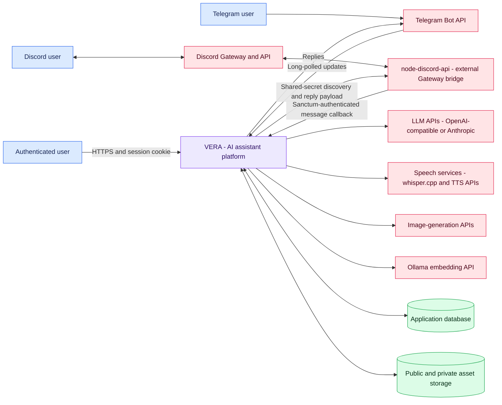
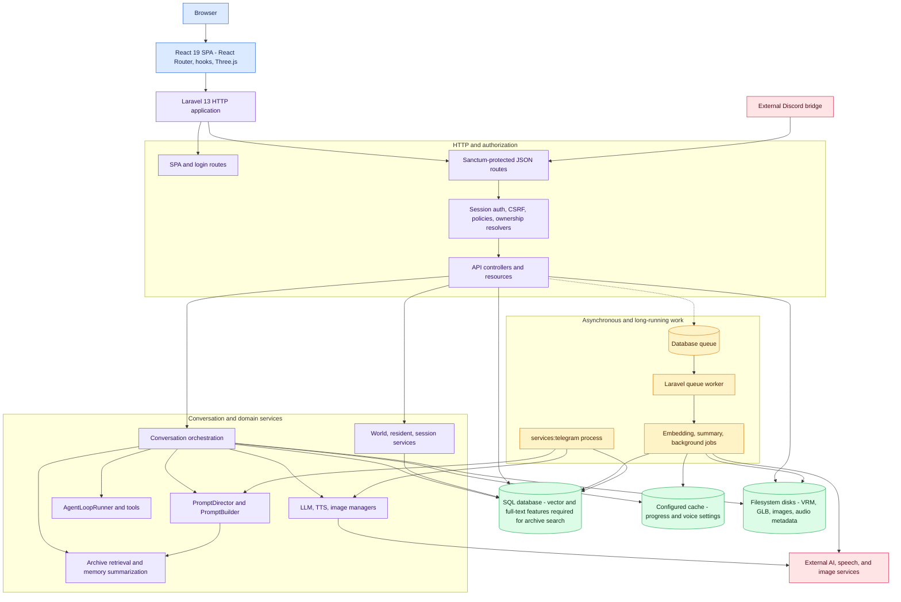

# System context and containers

VERA is a Laravel-hosted React SPA with three conversation entry paths: the browser, a Laravel-owned Telegram long poller, and an external Discord Gateway bridge. Model, speech, image, and embedding engines are HTTP dependencies; VERA owns conversation state and uploaded/generated assets.

## System context

The bridge is referenced and called by this repository but its Node source and deployment definition are not present here. Telegram is different: `services:telegram` is a long-running Artisan command inside this codebase.

## Container and component architecture

### Frontend boundaries

The SPA owns navigation, optimistic chat state, client retry-on-timeout, microphone VAD, audio playback, and the Three.js world. It does not call model providers directly. All persisted domain state and provider credentials stay behind Laravel.

### Backend boundaries

Controllers enforce the Sanctum boundary and resolve user-assistant or user-world membership. The conversation controller currently performs the central orchestration itself; managers normalize provider selection while `PromptDirector` assembles DB-authored prompt sections and injected context.

---

[Index](README.md) · [Next: Conversation runtime](02-conversation-runtime.md)
