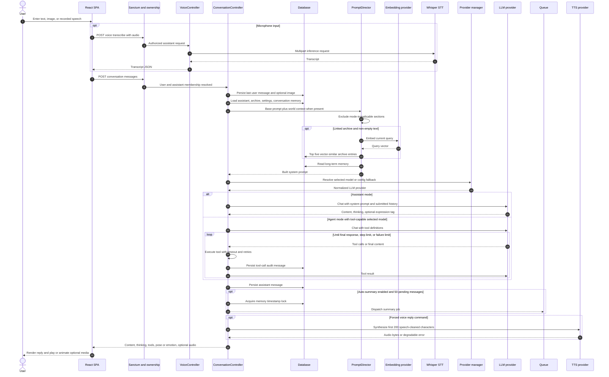
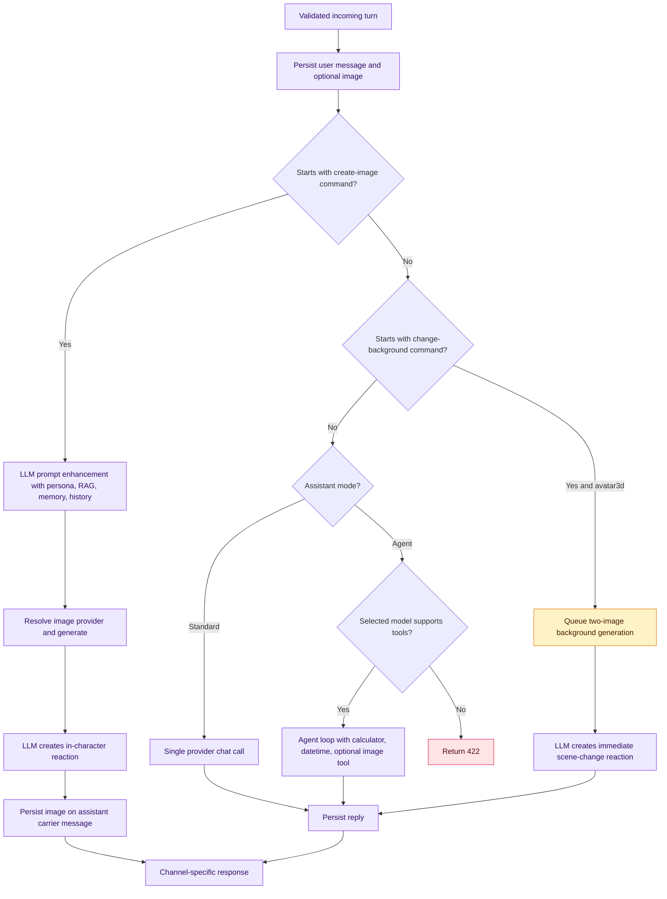
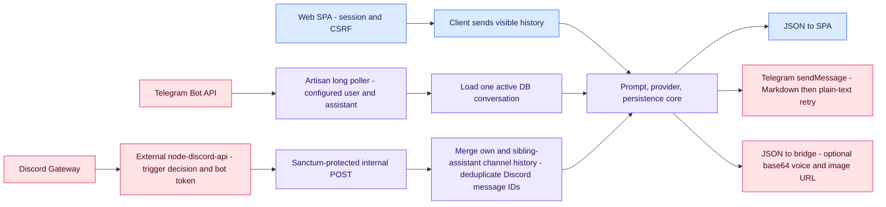

# Conversation runtime

This page follows a normal browser turn first, then shows channel-specific and optional branches. The sequence distinguishes persisted messages from client-supplied history: browser chat submits its visible history, while Telegram and Discord rebuild history server-side.

## End-to-end browser conversation

Browser voice mode is a two-request pipeline: VAD creates a WAV blob, `VoiceController::transcribe` returns text, then the normal message endpoint receives `voice_mode: true`. The reply is normally synthesized by a separate `VoiceController::synthesize` call from the SPA; `/send-voice-message` is the exceptional server-synthesized branch.

## Message branch routing

## Channel adapter differences

Discord server/channel prompts and sibling assistant names are injected by `PromptDirector::withDiscordEnvironment`. Telegram does RAG but currently does not inject long-term memory and does not use the browser/Discord auto-summary checkpoint.

---

[Previous](01-system-context.md) · [Index](README.md) · [Next: Data model](03-data-model.md)
