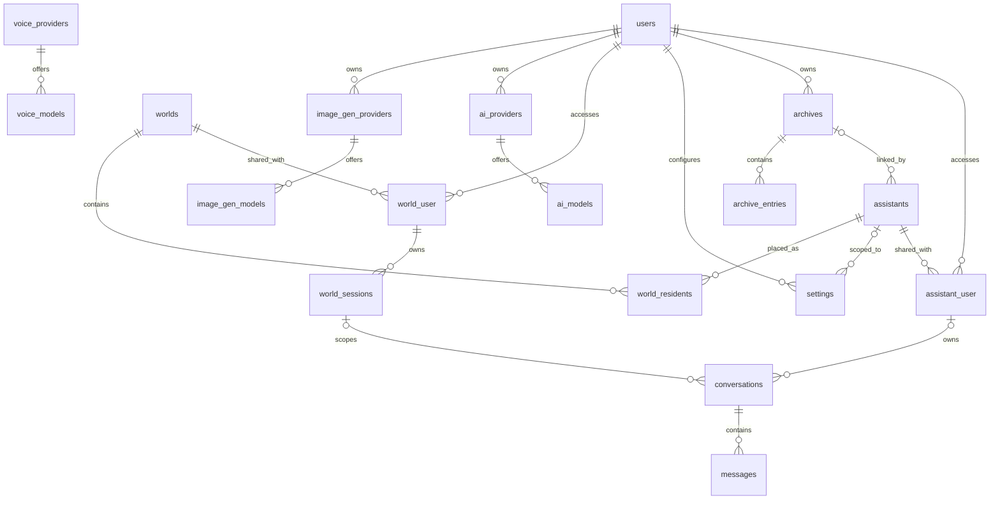
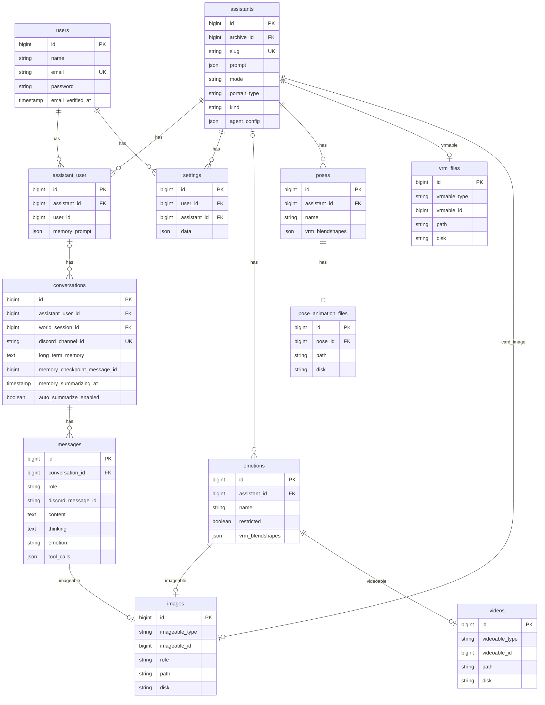
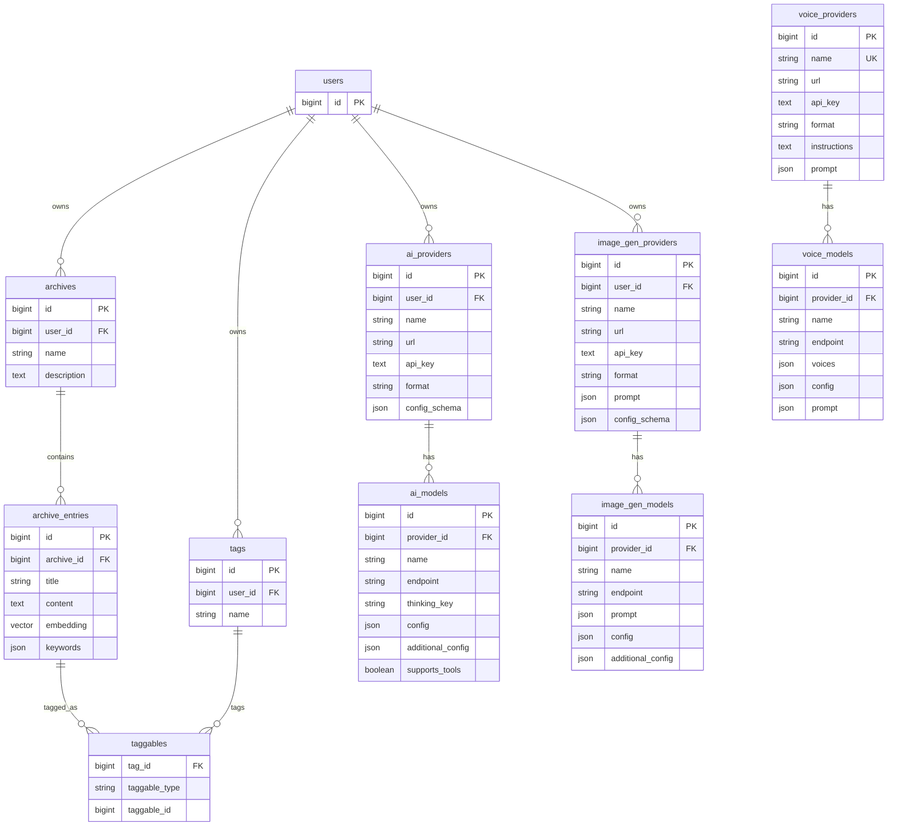
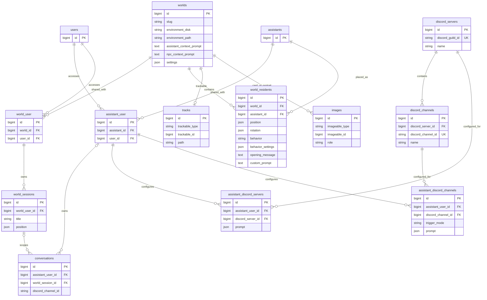
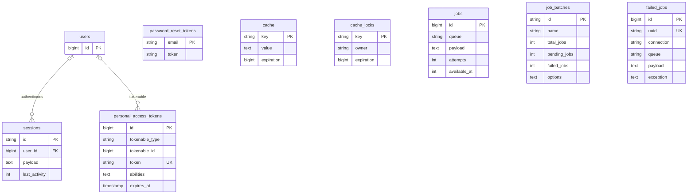

# Data model

The ERDs below represent the final schema after all migrations, not the order in which tables were introduced. Framework infrastructure tables are separated from domain tables so the relationships remain readable.

## Domain overview

## Identity, assistants, conversations, and media

`images`, `videos`, and `vrm_files` are polymorphic; the diagram names only model types used by current code. `memory_checkpoint_message_id` is an unsigned ID marker but has no database foreign-key constraint.

## Archives, tags, and providers

Voice providers are global in the schema; LLM and image providers belong to users. API keys use Laravel's encrypted cast and are hidden from serialized models.

## Worlds and Discord

DM rows are represented by `discord_channels.discord_server_id = null`. A Discord conversation stores the external channel snowflake directly; it does not foreign-key to `discord_channels`.

## Framework infrastructure

Laravel also creates the following infrastructure tables. They support session auth, Sanctum tokens, cached progress/settings, and the default database queue, but are not domain entities.

The two user edges are logical Eloquent/authentication relationships rather than declared database foreign keys. `personal_access_tokens` is polymorphic even though `User` is the current authenticatable model. `password_reset_tokens.email` is likewise a logical link to users. Cache and queue tables have no domain foreign keys.

---

[Previous](02-conversation-runtime.md) · [Index](README.md) · [Next: RAG and memory](04-rag-and-memory.md)
