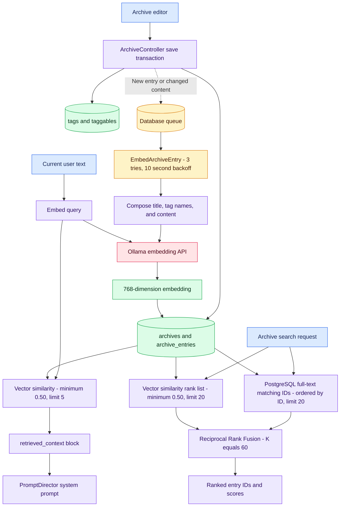
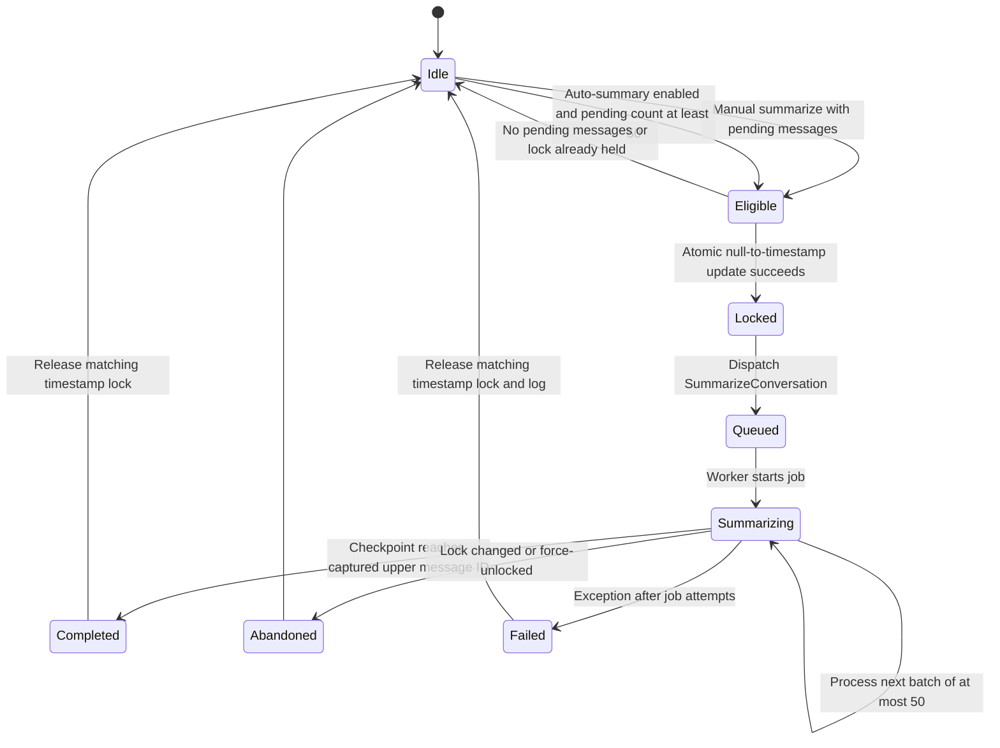
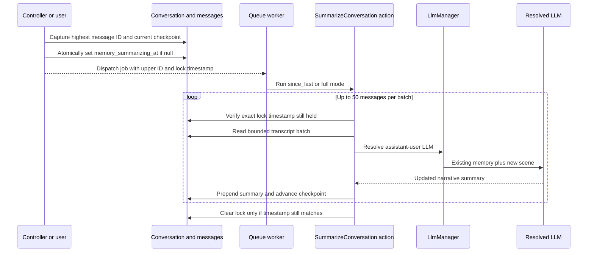

# RAG and long-term memory

VERA has two related but independent context systems. Archives provide assistant-linked knowledge through embeddings. Conversation memory condenses older turns into a per-conversation narrative. Both are inserted into the system prompt as explicitly untrusted context blocks.

## Archive ingestion and retrieval

Conversation-time RAG is vector-only. The hybrid full-text plus vector RRF action powers the archive search endpoint and editor UX; it is not used by `PromptDirector::withRetrieval`.

## Long-term memory state and job flow

`since_last` considers at most the latest 50 pending messages; `full` resets the checkpoint and permits a backlog of up to 200. The action prepends each new summary above existing memory. On subsequent web, world, image-enhancement, background, and Discord turns, `PromptDirector` injects that text in a `long_term_memory` block.

### Context assembly order

```mermaid
flowchart LR
    base["Assistant prompt JSON"] --> world["Optional world and resident context"] --> modes["Mode-specific section filtering"] --> voice["Optional voice provider and model prompts"] --> rag["Optional retrieved_context"] --> memory["Optional long_term_memory"] --> build["PromptBuilder plain-text system prompt"]

    classDef core fill:#ede9fe,stroke:#7c3aed,color:#2e1065
    class base,world,modes,voice,rag,memory,build core
```

---

[Previous](03-data-model.md) · [Index](README.md) · [Next: Provider resolution](05-provider-resolution.md)
