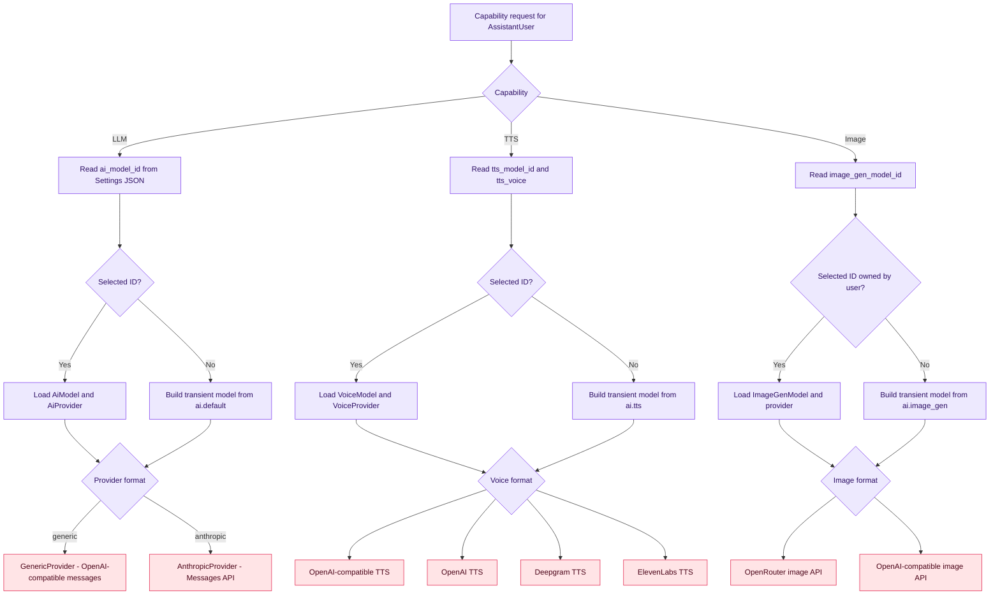
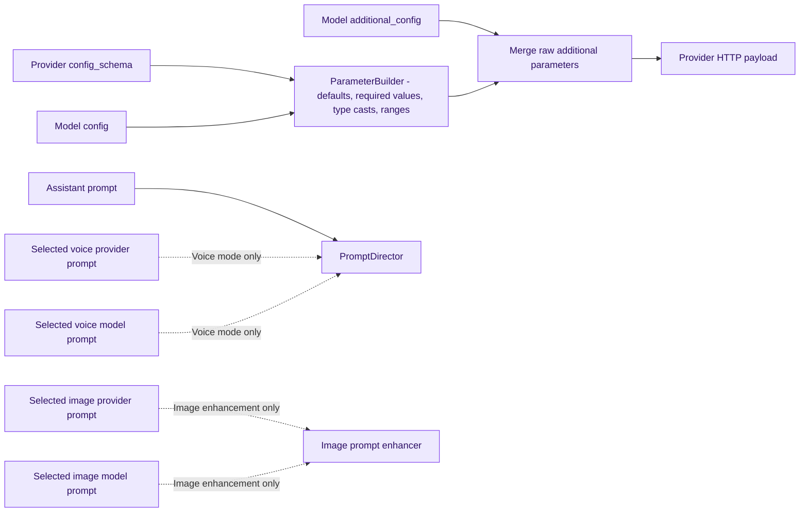

# Provider resolution

LLM, TTS, and image generation share the same two-level pattern: a selected database model wins, otherwise `config/ai.php` creates an in-memory provider/model pair from environment values. Embeddings and STT are container-bound singletons with no per-user selection.

## Resolution matrix

| Capability | Selection scope | Database formats | Config fallback | Failure if unavailable |
| --- | --- | --- | --- | --- |
| LLM | `settings.data.ai_model_id` per user and assistant | `generic`, `anthropic` | `AI_DEFAULT_*` | invalid-argument exception; controller commonly returns 502 |
| Agent LLM | Same as LLM, but explicit model required | Model must have `supports_tools` | None | 422 before loop |
| Embeddings | Application-wide binding | None | `AI_EMBEDDING_URL`, `AI_EMBEDDING_MODEL` | runtime exception from Ollama provider |
| STT | Application-wide binding | None | `AI_STT_URL`, `AI_STT_MODEL` | 502 from voice or Discord endpoint |
| TTS | `settings.data.tts_model_id` and `tts_voice` per user and assistant | `openai_compatible`, `openai_tts`, `deepgram`, `elevenlabs` | `AI_TTS_*` | 502, except forced replies degrade to text |
| Image generation | `settings.data.image_gen_model_id` per user and assistant | `openrouter`, `openai_compatible` | `IMAGE_GEN_*` | 502 or unavailable agent tool |

## Resolver flow

## Prompt and parameter composition

The selected voice model is resolved twice in normal voice mode: once to inject provider/model prompt sections and derive LLM options, then later by the synthesize endpoint. A forever cache stores only `{tts_model_id, tts_voice}` and is explicitly refreshed by voice-setting updates.

---

[Previous](04-rag-and-memory.md) · [Index](README.md) · [Next: Avatar and World](06-avatar-and-world.md)
