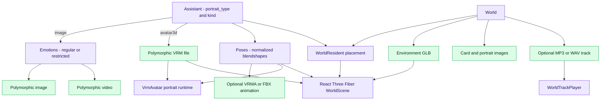
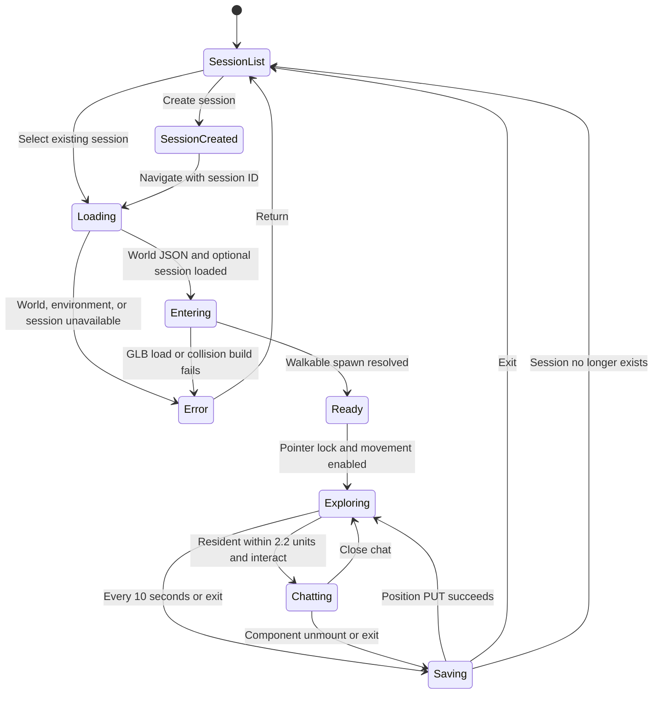
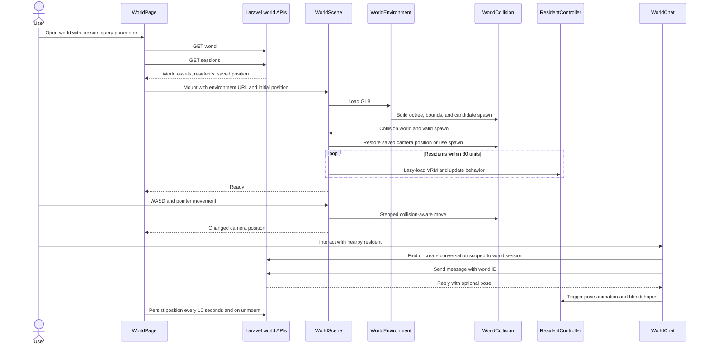
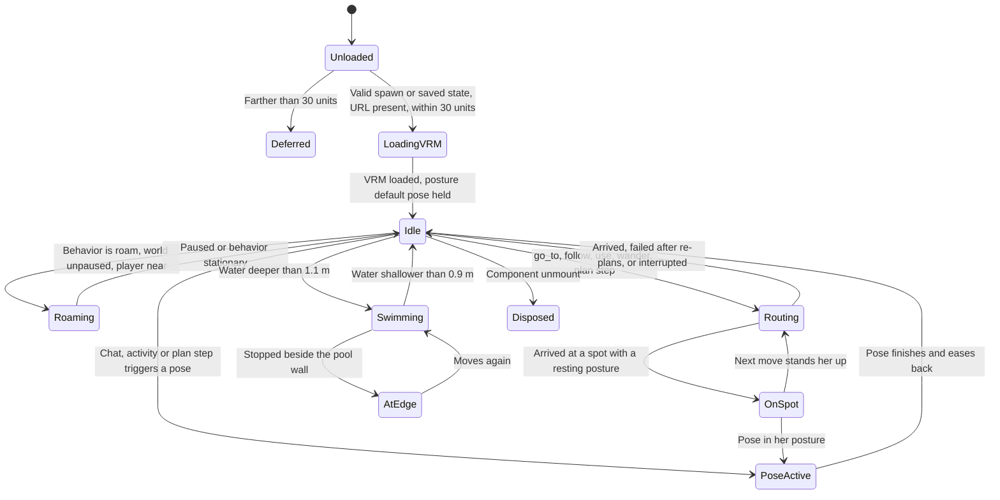
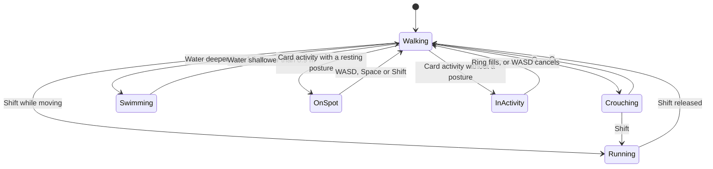
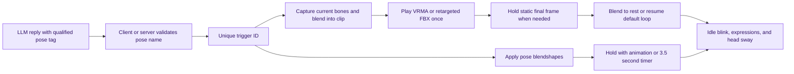

# Avatar and World runtime

VERA has two presentation modes. Image portraits use emotion images/videos and `[emotion: name]` tags. `avatar3d` assistants use a VRM file, poses, blendshapes, and optional VRMA/FBX animation files with `[pose: name]` tags. Worlds place only VRM-backed assistants or NPCs as residents.

## Asset and runtime relationships

## World entry and session lifecycle

## Resident behavior and pose state

Residents move along navigation-grid routes through the same collision world as the player, keep to the middle of doors, take steps straight on, and recover from getting stuck by stepping back, then routing around the failed spot. Each posture has its own default pose; on a spot her hips are fitted to the marked surface. In deep water she floats and swims, and rests at the pool's edge when she stops beside it. Autonomous residents choose their next step themselves while the user is present and active, with a thought bubble showing the reason and action. Each resident's position, spot and posture are saved per session and restored on return; the player's camera position is saved alongside.

## Player interaction

The player is a first-person view with no body. `FirstPersonController` keeps a player state (foot position, movement mode, posture, held spot and activity) that every other part of the world reads, so swimming and postures never skew positions sent to residents or saved to the session.

- **Location**: `LocationTracker` resolves the innermost zone and floor every 150 ms with a client port of `ResolveWorldState`, and the page shows a title card on crossings (not when re-entering a zone left under 2 s earlier) and a readout above the minimap.
- **Swimming**: the body keeps walking the pool floor through the collision world, so walls and steps still collide; only the view floats just above the surface. The depths are the residents' own.
- **Discovery**: object markers are points with no mesh, so `SpotBeacons` draws at them: a breathing dot at objects within 6 m, and for the focused object (within 2.5 m, preferring the one looked at) a shader ring per spot and a light column. E opens the object card, G the zone card; arrows and Enter choose an activity.
- **Activities**: resting activities glide the view onto the spot at that posture's eye height with limited look-around; standing and zone activities fill a 3 s ring. The user holds spots in the same `occupiedSpots` map residents use, so neither can take the other's spot.
- **Residents knowing**: chat messages and idle decisions carry `userState`, resolved against the layout into the "the user is" line. Each activity becomes an action line for residents who can see the user (same floor, within 15 m, line of sight, within 4 m or facing within 110°): the resident in the open conversation gets it as the user's message and replies; every other onlooker records a first-person observation of her own through `POST /api/worlds/{world}/sessions/{session}/residents/{resident}/observations`. Idle decisions include her last 6 conversation messages, so observations reach them too.
- **Facing the user**: during a conversation a resident who is standing still or treading water turns toward the user; one holding a seat, bed or lounger keeps its direction.

## Portrait pose lifecycle

## Music lifecycle

An optional world track starts only after the world reaches `ready`. On track end it fades out over 600 ms, waits 3 seconds, restarts, and fades back in. Mute and volume are client-only; volume persists in `localStorage`, not the database.

---

[Previous](05-provider-resolution.md) · [Index](README.md) · [Next: Deployment and operations](07-deployment-and-operations.md)
