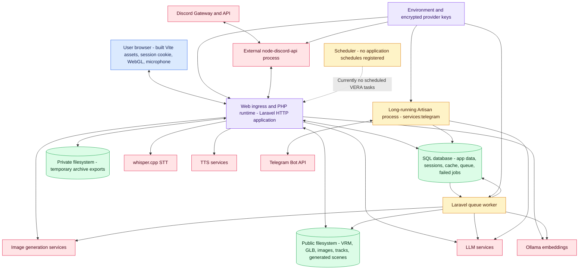
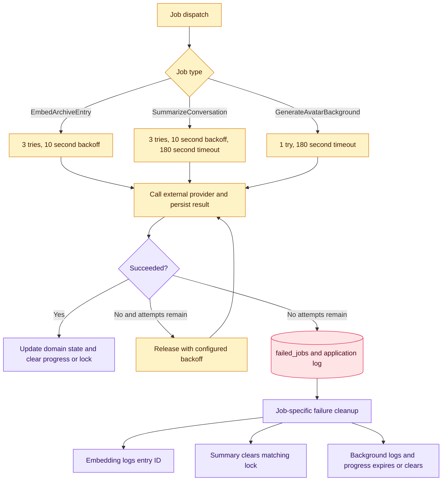
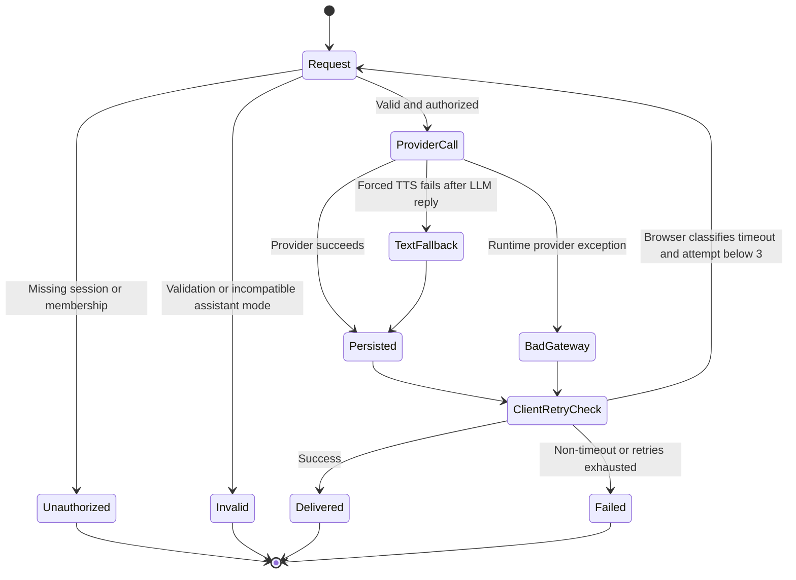
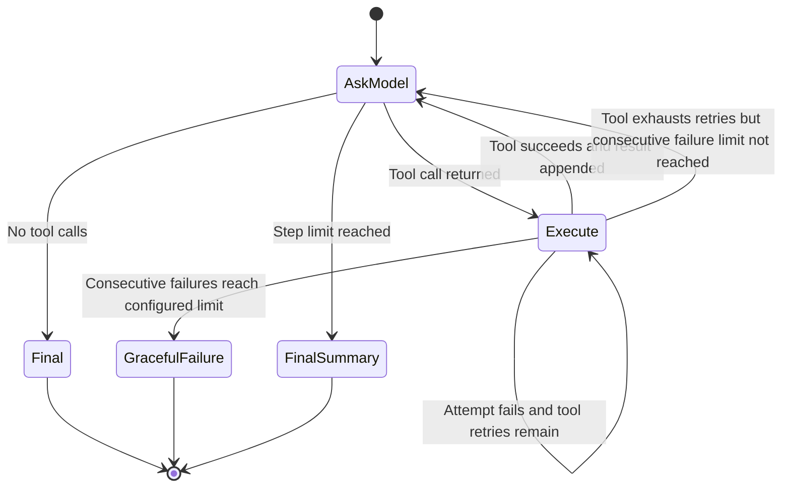

# Deployment and operations

The repository does not contain Docker, Kubernetes, systemd, Horizon, or a production process manifest. This topology shows the runtime roles required by code and config; the exact hosts and supervisors remain deployment choices.

## Runtime topology

### Required runtime roles

- The HTTP role serves Laravel and the built SPA. Public storage must be exposed through Laravel's storage link or an equivalent shared asset URL.
- A queue worker is required for archive embeddings, memory summaries, and generated avatar backgrounds. The default queue, session, and cache drivers in `.env.example` are database-backed.
- `services:telegram` is a separate, continuously supervised process when Telegram is enabled.
- Discord requires the separately deployed Node bridge, its bot tokens, and the same internal secret configured on both sides.
- AI services may be local or remote. Code assumes only their HTTP contracts, timeouts, and credentials.
- No application task is registered with Laravel's scheduler in `routes/console.php`.

## Queue job behavior

## Request and provider failure paths

The browser hook retries failures whose message looks like a timeout, execution-time error, 502, or 504, up to three attempts with a two-second pause. Because the user message is persisted before the provider call, a retried POST can create duplicate persisted user turns. This is current behavior, not an idempotent retry protocol.

## Agent tool failure state

Agent tool timeout enforcement requires the PHP `pcntl` extension. Each call is persisted as a `messages.role = tool_call` audit record and filtered out of normal message-history responses.

## Channel recovery behavior

- Telegram polling catches transport/API errors, respects Telegram `retry_after` when supplied, sleeps, and resumes. Per-update failures are isolated so the outer loop continues. Reply delivery retries once without Markdown parsing.
- Discord discovery returns a specific 502 when the bridge is unreachable and a non-error empty result when no bot is configured. Message processing failures are returned to the bridge as HTTP errors; bridge retry policy is outside this repository.
- TTS connection failures normally return 502. `/send-voice-message` and Discord voice-response synthesis instead report an audio error while preserving the text reply.
- Background generation deliberately does not fail the initiating chat request, even when a synchronous queue driver surfaces the job exception.

---

[Previous](06-avatar-and-world.md) · [Index](README.md) · [Next: Code-grounded caveats](08-code-grounded-caveats.md)
